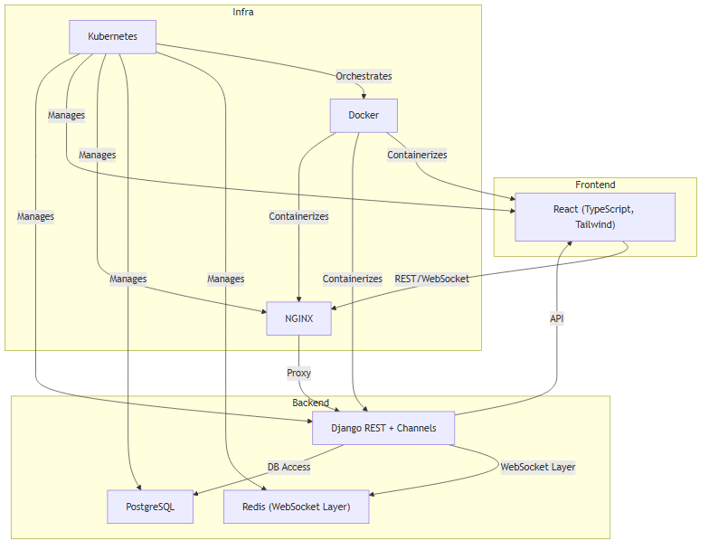
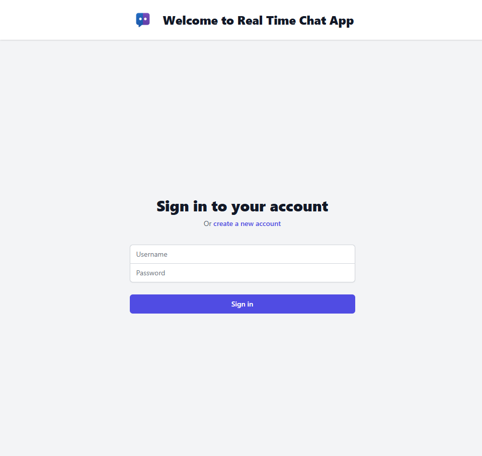
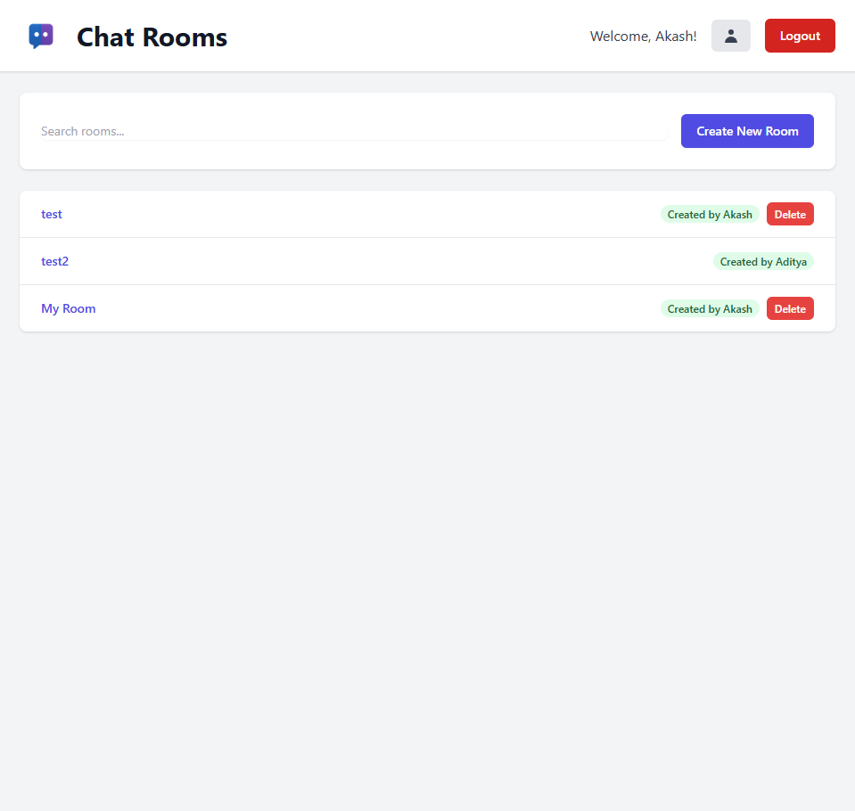
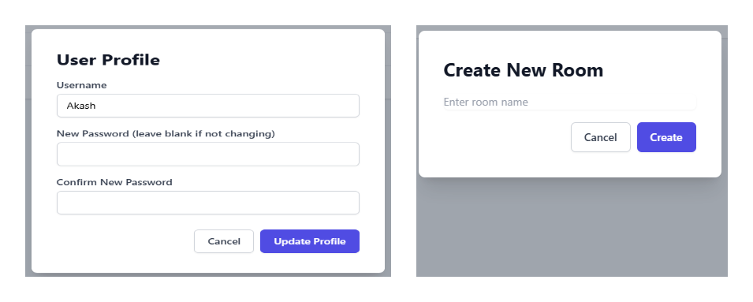
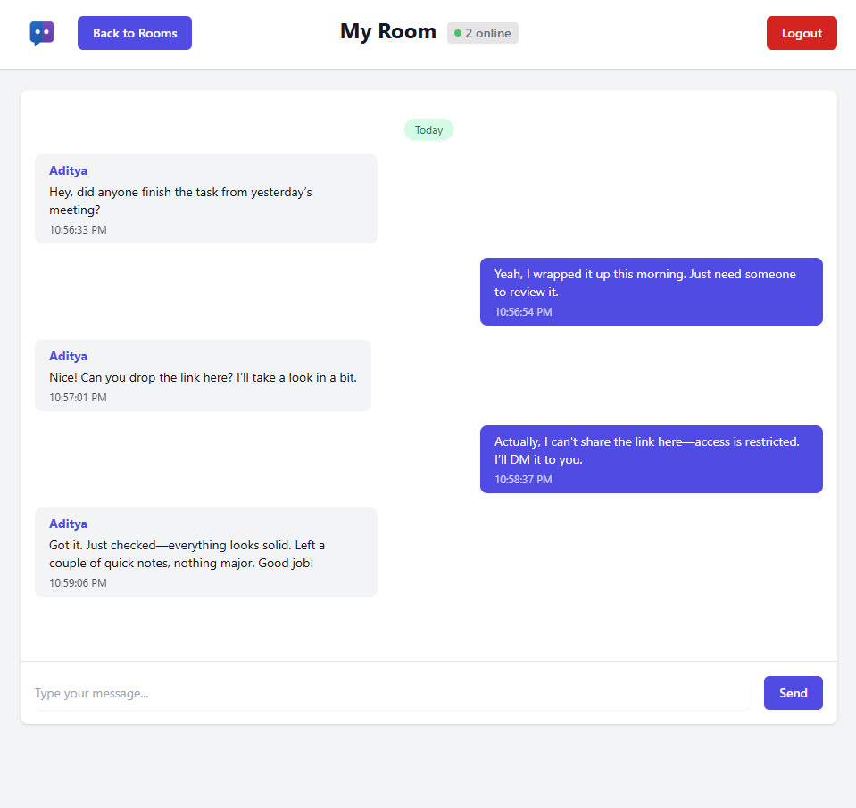

# Real-Time Chat Application

A real-time chat application built with Django REST Framework and React.

---

## Tech Stack & Architecture



- **Frontend:** React (TypeScript, Tailwind CSS)
- **Backend:** Django REST Framework, Django Channels (WebSocket)
- **Database:** PostgreSQL
- **WebSocket Layer:** Redis
- **Proxy:** NGINX
- **Containerization:** Docker
- **Orchestration:** Kubernetes

---

## Prerequisites

- [Docker](https://www.docker.com/)
- [Docker Compose](https://docs.docker.com/compose/)
- [Kubernetes](https://kubernetes.io/) (e.g., Minikube, Docker Desktop, or a cloud provider)
- [kubectl](https://kubernetes.io/docs/tasks/tools/)

---

## Local Development (Docker Compose)

1. **Clone the repository:**
   ```bash
   git clone https://github.com/akash720/real-time-chat-app.git
   cd real-time-chat-app
   ```
2. **Start all services:**
   ```bash
   docker-compose up --build
   ```
3. **Access the application:**
   - Frontend: http://localhost:3000
   - Backend API: http://localhost:8000

---

## Kubernetes Deployment

### Build & Deploy

1. **Build Docker images and restart deployments:**
   From root project directory, run:
   ```bash
   docker build -t chat-frontend:latest ./frontend && kubectl rollout restart deployment chat-frontend
   docker build -t chat-backend:latest ./backend && kubectl rollout restart deployment chat-backend
   docker build -t chat-nginx:latest ./nginx && kubectl rollout restart deployment chat-nginx
   ```
2. **Scale all deployments (if needed):**
   ```bash
   kubectl scale deployment --all --replicas=1
   ```
3. **Apply manifests (if not already applied):**
   ```bash
   kubectl apply -f k8s/
   ```

**Access the application on your localhost using the default ports after deployment.**

### Required Secrets

Create the required secrets before deploying:
```bash
kubectl apply -f k8s/secrets.yaml
```

---

## Dependencies

### Backend (see `backend/requirements.txt`)
- Django 4.2
- Django REST Framework
- Django Channels
- channels-redis
- psycopg2-binary
- daphne
- django-cors-headers
- django-rest-swagger
- djangorestframework-simplejwt
- gunicorn
- whitenoise

### Frontend (see `frontend/package.json`)
- React 18
- TypeScript
- Tailwind CSS
- axios
- react-router-dom
- @headlessui/react, @heroicons/react

---

## Project Structure
```
.
├── backend/             # Django backend
├── frontend/            # React frontend
├── nginx/               # NGINX config
├── k8s/                 # Kubernetes manifests
├── docker-compose.yml   # Local dev orchestrator
└── README.md            # Project documentation
```

---

## Service Overview
- **Frontend:** Serves the React SPA, communicates with backend via REST/WebSocket.
- **Backend:** Django REST API, WebSocket endpoints via Channels, handles auth, chat, and persistence.
- **NGINX:** Proxies frontend, API, and WebSocket traffic.
- **PostgreSQL:** Stores user and message data.
- **Redis:** WebSocket layer for Django Channels.
- **Kubernetes:** Orchestrates all services for production.

---

## Screenshots





---

## License
MIT 